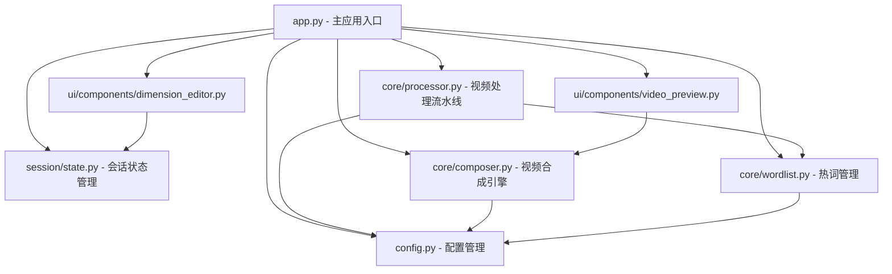
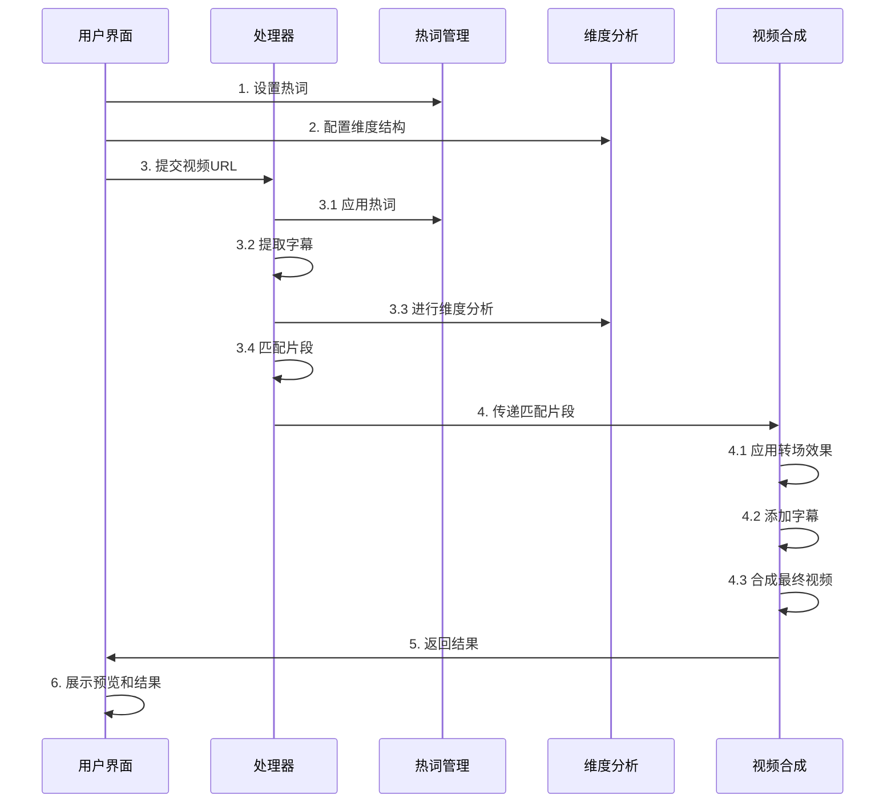
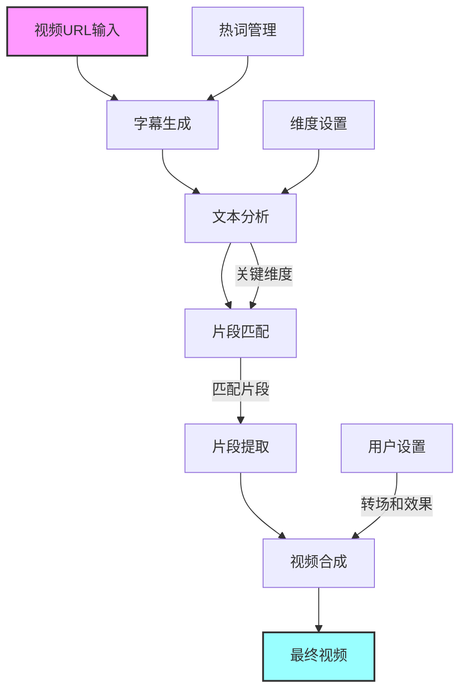

# AI视频分析系统流程图

本项目是一个用于视频内容分析、片段提取和合成的系统，采用了模块化设计。以下是系统的主要组件及其交互关系：

## 系统架构图

## 主要处理流程

## 数据流图

## 组件关系详解

### 1. 主应用入口 (app.py)

应用的中心组件，负责初始化其他所有组件并连接UI与后端处理逻辑。主要功能：

- 配置Streamlit应用
- 管理导航和页面切换
- 初始化和管理会话状态
- 连接用户交互与处理逻辑

### 2. 配置管理 (config.py)

管理整个应用的配置参数，包括：

- 处理流程步骤配置
- 默认维度结构
- 转场效果参数
- 文件路径配置

### 3. 会话状态管理 (session/state.py)

管理用户会话状态，实现：

- 设置保存与加载
- 项目状态持久化
- 处理结果缓存
- 页面导航历史

### 4. 视频处理流水线 (core/processor.py)

核心处理逻辑，实现：

- 视频字幕生成
- 维度分析
- 片段匹配
- 结果排序和过滤

### 5. 视频合成引擎 (core/composer.py)

负责将匹配片段合成最终视频，功能包括：

- 片段裁剪和拼接
- 转场效果应用
- 字幕叠加
- 片尾标语处理

### 6. 热词管理 (core/wordlist.py)

管理语音识别热词，提供：

- 热词创建和管理
- 与云服务API交互
- 热词权重调整
- 本地热词缓存

### 7. UI组件

系统包含多个专用UI组件，如：

- 维度编辑器 (dimension_editor.py)：提供可视化维度编辑
- 视频预览 (video_preview.py)：展示片段和效果预览

## 工作流程说明

1. **初始设置**
   - 用户配置热词和维度结构
   - 系统保存这些设置到会话状态

2. **视频分析**
   - 用户提供视频URL
   - 处理器使用热词进行字幕提取
   - 应用维度分析确定片段相关性
   - 根据匹配阈值筛选片段

3. **结果处理**
   - 视频合成引擎处理匹配片段
   - 应用用户指定的转场效果
   - 生成最终视频

4. **结果展示**
   - 用户界面展示分析结果和预览
   - 提供导出和进一步处理的选项
